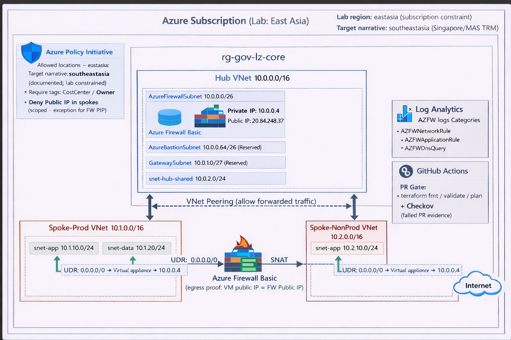

# Governance Architect — Azure Landing Zone (Hub–Spoke + Policy-as-Code + DevSecOps)

This repository demonstrates a **compliance-first Azure Landing Zone** implementation with:
- **Hub–Spoke network isolation**
- **Centralized egress** enforced by **Azure Firewall + UDR**
- **Guardrails as code** (Azure Policy-as-Code)
- **PR gate** via GitHub Actions (terraform checks + Checkov)

> **Lab region:** `eastasia` (subscription constraint)  
> **Target narrative:** `southeastasia` (Singapore / regulated industry story)

---

## Architecture (Final)


**Core ideas**
- Hub hosts shared security and egress control (Azure Firewall).
- Spokes (Prod / NonProd) run workloads with **no direct Internet path**.
- Spoke subnets are forced to egress via Hub Firewall using **UDR default route**.
- Governance guardrails prevent non-compliant deployments (location/tags/public IP).
- CI ensures every PR is formatted, validated, planned, and security-scanned.

---

## What I built (by day)

### Day2 — Hub–Spoke foundation (Peering + IaC baseline)
**Evidence**
- Hub peering connected: `docs/architecture/day02-portal-hub-peering-connected.png`
- RG overview: `docs/architecture/day02-portal-rg-core-overview-ok.png`
- Terraform apply ok: `docs/architecture/day02-tf-dev-apply-ok.png`
- Terraform plan no changes: `docs/architecture/day02-tf-dev-plan-nochanges.png`

---

### Day3 — Centralized egress via Azure Firewall + UDR (SNAT + Audit)
**Goal**
- Force spoke subnets to route `0.0.0.0/0` to firewall private IP (VirtualAppliance).
- Prove egress SNAT: VM egress IP equals firewall public IP.
- Capture firewall logs in Log Analytics for audit.

**Evidence**
- Firewall outputs (IPs): `docs/architecture/day03-dev-tf-firewall-rg-core-output-ips-ok.png`
- Subnet association proof (UDR bound to subnets):
  - `docs/architecture/day03-dev-portal-udr-spoke-nonprod-assoc-snet-app-ok.png`
  - `docs/architecture/day03-dev-portal-udr-spoke-nonprod-assoc-snet-data-ok.png`
  - `docs/architecture/day03-dev-portal-udr-spoke-prod-assoc-snet-app-ok.png`
  - `docs/architecture/day03-dev-portal-udr-spoke-prod-assoc-snet-data-ok.png`
- Strongest proof (UDR default route → firewall):
  - `docs/architecture/day03-dev-portal-udr-spoke-nonprod-default-to-fw-ok.png`
  - `docs/architecture/day03-dev-portal-udr-spoke-prod-default-to-fw-ok.png`
- SNAT egress proof (Run Command):  
  - `docs/architecture/day03-dev-cli-vm-spoke-nonprod-runcommand-egress-ip-ok.png`
- Audit proof (AZFW logs in Log Analytics):
  - `docs/architecture/day03-dev-logs-azfw-rg-core-query-ok.png`
- Resource inventory proof:
  - `docs/architecture/day03-dev-portal-rg-rg-core-resource-list-ok.png`

---

### Day4 — Policy-as-Code (Deny proofs)
**Guardrails enforced**
- Allowed locations: `eastasia` only (lab)
- Require tags: `CostCenter`, `Owner`
- Deny Public IP creation (scoped) with exception for Azure Firewall public IP

**Evidence**
- Policy assignments visible (Portal): `docs/architecture/day04-portal-subscription-policy-assignment-ok.png`
- Deny non-allowed location (eastus): `docs/architecture/day04-cli-deny-location-eastus.png`
- Deny missing required tags: `docs/architecture/day04-cli-deny-tags-missing.png`
- Deny Public IP creation: `docs/architecture/day04-cli-deny-publicip-rg-core.png`

> If your actual filenames include an extra `.png` (e.g. `...png.png`), keep them as-is or rename for consistency.

---

### Day5 — CI/CD PR gate (Terraform + Checkov)
**PR checks**
- `terraform fmt -check`
- `terraform validate`
- `terraform plan`
- Checkov scan + intentional failure evidence

**Evidence**
- CI pass: `docs/architecture/day05-actions-ci-terraform-checkov-ok.png`
- PR blocked by CI (intentional fail): `docs/architecture/day05-actions-ci-pr-blocked-failed.png`
- Checkov failure details: `docs/architecture/day05-actions-ci-terraform-checkov-failed.png`

---

### Day6 — Portfolio packaging (Architecture + Narrative)
**Artifacts**
- Final architecture PNG: `docs/architecture/day06-dev-drawio-landingzone-architecture-diagram-final.png`
- Source diagram: `docs/architecture/day06-dev-drawio-landingzone-architecture-source.drawio`
- Evidence index: `docs/evidence.md`
- Decision log: `docs/decision-log.md`

---

## Repo structure
```text
docs/
  architecture/        # diagrams + screenshots
  evidence.md          # evidence index
  decision-log.md      # decision log / trade-offs
infra/terraform/
  envs/dev/            # dev environment
  modules/             # reusable modules (hub/spoke/firewall/udr/policy)
.github/workflows/
  ci.yml               # PR gate workflow
```

## How to run (repro)
> ⚠️ Azure Firewall is not free. Destroy after evidence capture.

```bash
cd infra/terraform/envs/dev
terraform init
terraform fmt -recursive
terraform validate
terraform plan
terraform apply

# clean up
terraform destroy
```


## Notes (hygiene)
- Never commit: `terraform.tfstate`, `.terraform/`, plan output files.
- Tags (`CostCenter`, `Owner`) support accountability and cost tracking.
- Lab region uses `eastasia` due to subscription constraints.
